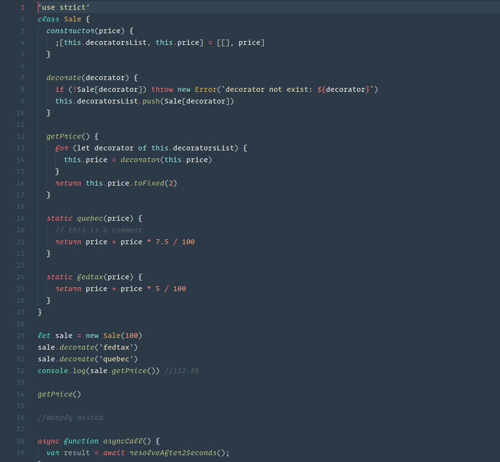
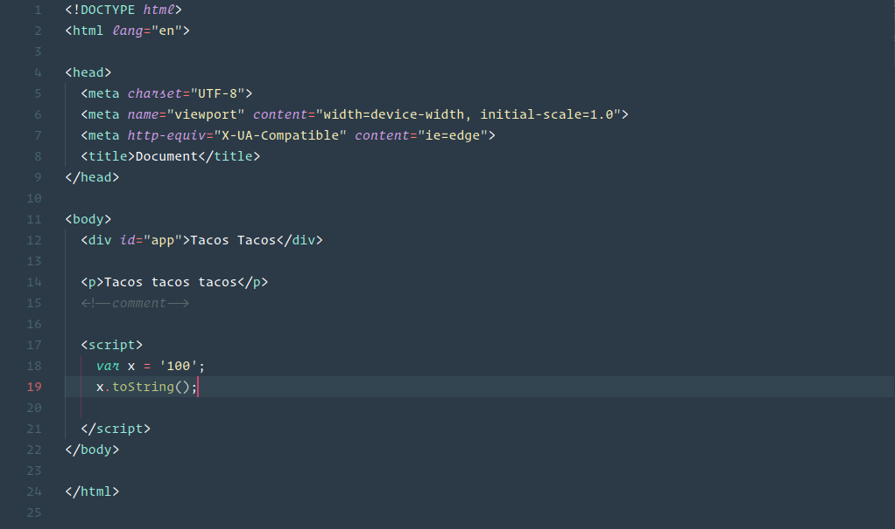
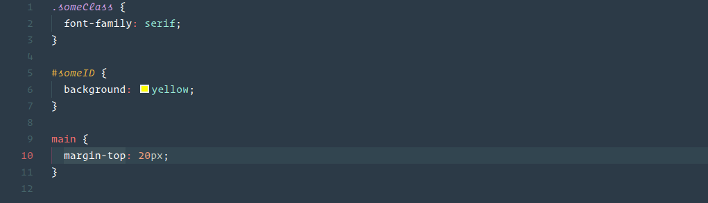
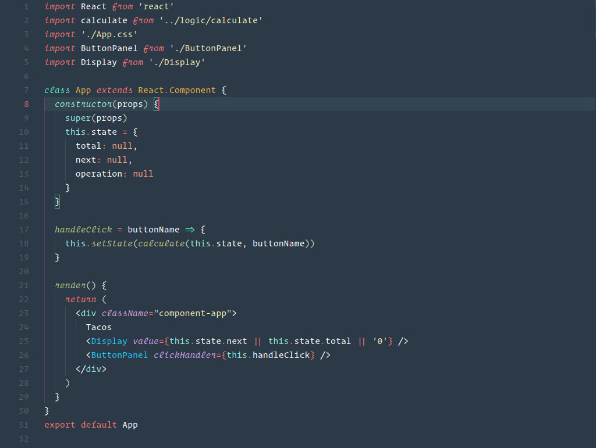
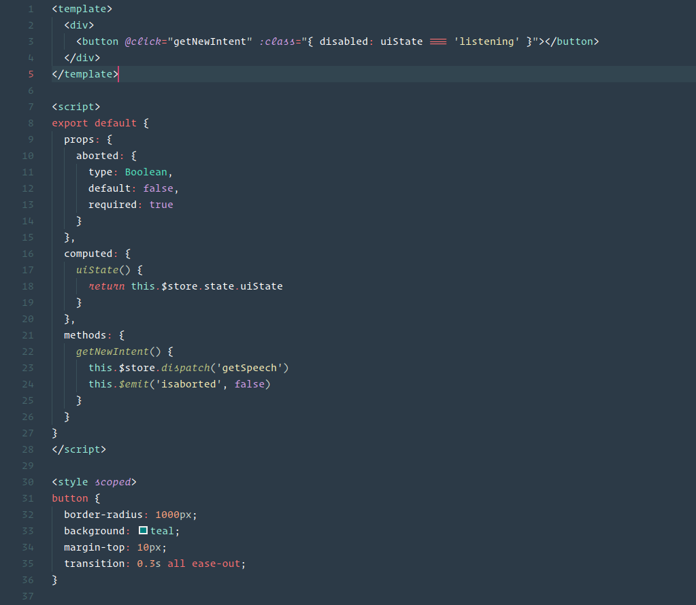
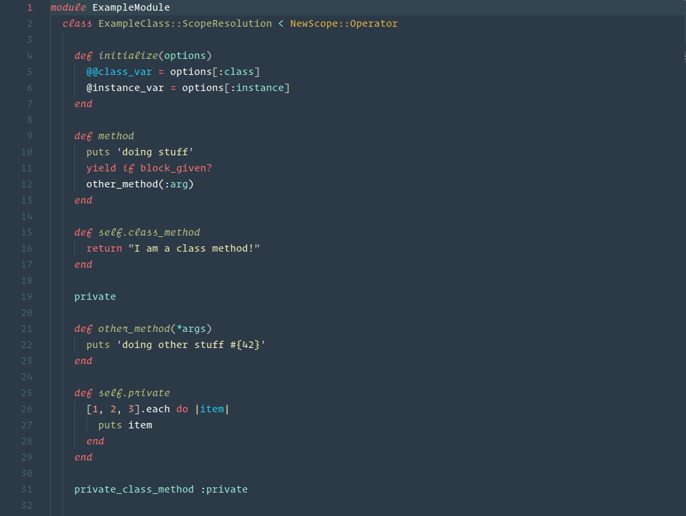
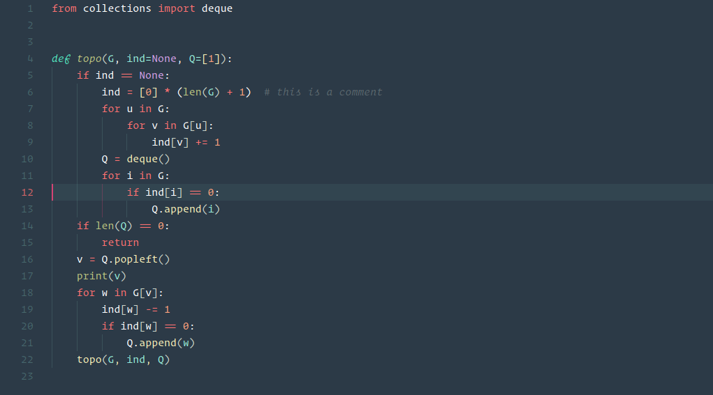
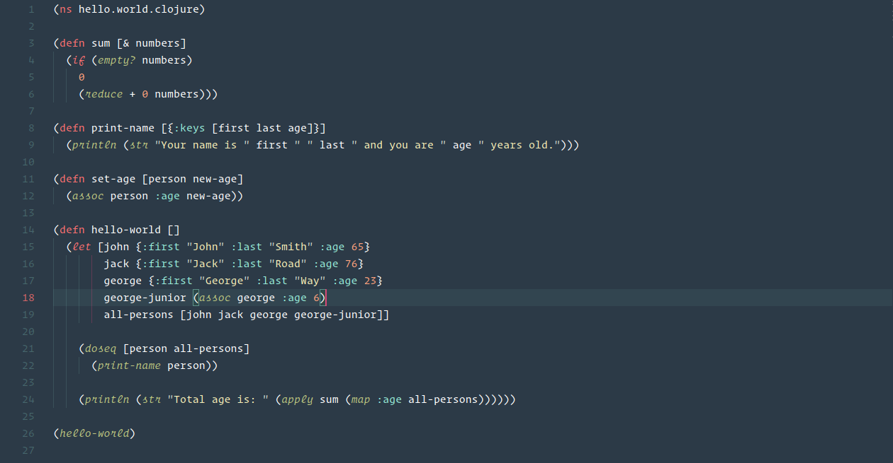
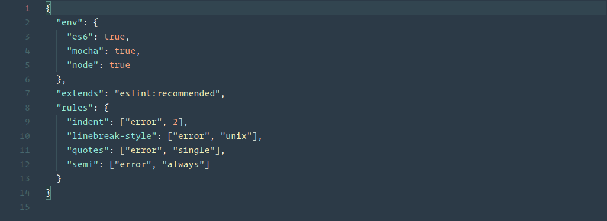

# [sa'unf]

A colourful theme for vscode, handcrafted and opensource. Comes with dimmed background and an option for no italics. Enjoy!

## Screenshots
### Javascript

### HTML

### CSS

### React

### Vue

### Ruby

### Python

### Clojure

### JSON

## Installation

1.  Install [Visual Studio Code](https://code.visualstudio.com/)
2.  Launch Visual Studio Code
3.  Choose **Extensions** from menu
4.  Search for `saunf-theme-vscode`
5.  Click **Install** to install it
6.  Click **Reload** to reload the Code
7.  From the menu bar click: Code > Preferences > Color Theme > **saunf**

## Disable Italics

If you wish to disable italics, there is now a no-italic theme available. You will have access to both, select **Understated No Italics** as your color theme.

## Variants
A variant with dimmed background is available.

## Contributing

Feel free to file an issue [file an issue](https://github.com/hnrchrdl/saunf-theme-vscode/issues) or send a pull request!

## Credits

Thanks you Sarah Drasner for writing this [blog post](https://css-tricks.com/creating-a-vs-code-theme/)  about vscode theme creation and the demos that I took over from her [Night Owl](https://marketplace.visualstudio.com/items?itemName=sdras.night-owl) theme.

## Inspiration

This palette was inspired in part by the [Indian Palette](https://flatuicolors.com/palette/in).